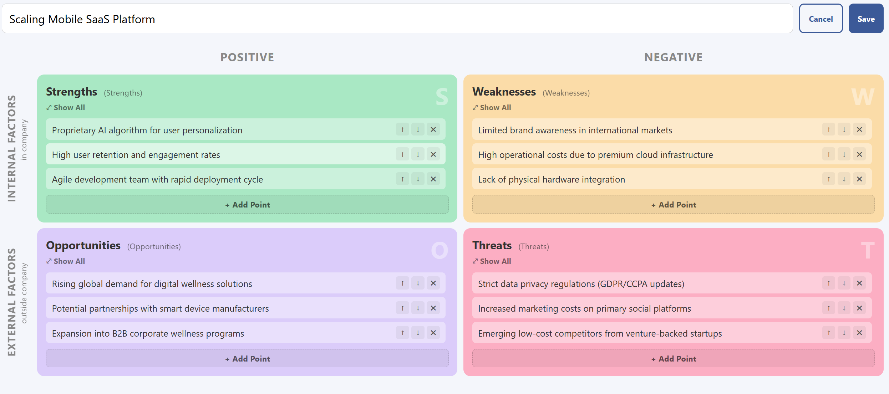

# SWOT Strategy Builder

A simple, interactive tool for performing SWOT analysis and deriving actionable strategies using Drag & Drop methodology.

## Features

- **Interactive SWOT Matrix**: Easily add Strengths, Weaknesses, Opportunities, and Threats.
- **Drag & Drop Strategy Engine**: Combine internal and external factors to automatically generate:
    - **SO Strategies** (Strengths + Opportunities)
    - **WO Strategies** (Weaknesses + Opportunities)
    - **ST Strategies** (Strengths + Threats)
    - **WT Strategies** (Weaknesses + Threats)
- **Multi-language Support**: Seamlessly switch between Czech and English.
- **Data Portability**: Export and Import your analyses via JSON files.
- **Local Persistence**: All data is automatically saved in your browser's Local Storage.
- **Responsive Design**: Works on desktops and tablets.

## How to Use

1. **Fill the Matrix**: Add points to S, W, O, and T boxes.
2. **Derive Strategies**: Drag a point from one quadrant and drop it onto another compatible quadrant (e.g., drag a Strength onto an Opportunity) to create a new strategy row.
3. **Refine**: Write down the specific action plan for each combined strategy.
4. **Export**: Save your work as a JSON file for backup or sharing.

## Installation / Development

This is a pure client-side application. No backend or installation is required.

1. Clone this repository.
2. Open `index.html` in any modern web browser.

## Project Structure

- `index.html`: Main application structure.
- `style.css`: Modern UI styling.
- `script.js`: Application logic (Drag & Drop, State management).
- `translations.js`: Localization dictionary.
- `swot_data.en.json`: Generic English template for testing.
- `swot_data.cs.json`: Generic Czech template for testing.

## License

This project is licensed under the MIT License - see the [LICENSE](LICENSE) file for details.
